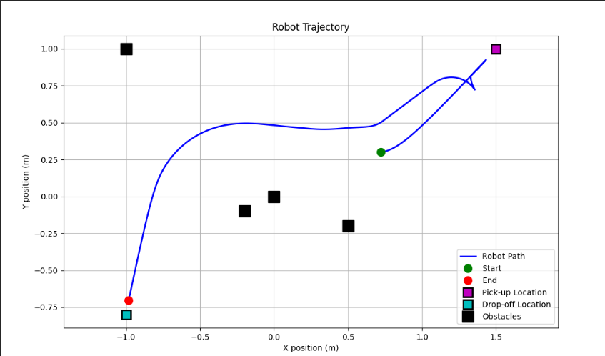
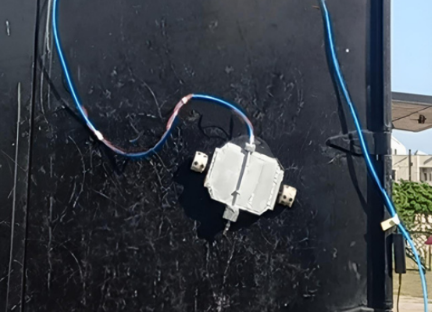
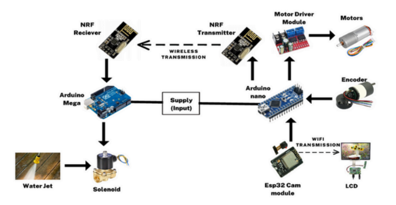
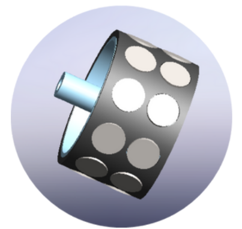

# 👋 Hi, I'm Fatimah Tahira Husain
*Mechatronics Engineer | Robotics | Control Systems | Embedded Design*  

📍 Ontario, Canada  
📧 [fatimah.husain2000@gmail.com](mailto:fatimah.husain2000@gmail.com)  
🔗 [LinkedIn](https://www.linkedin.com/in/fatimah-t-husain) | [Resume (PDF)](resume.pdf)  

---

## 🧑‍💻 About Me
I am a Mechatronics Engineer with a Master in Electrical & Computer Engineering from the University of Waterloo.  
I specialize in **control systems, robotics, embedded systems, circuit design and PCB design**, and I’m passionate about building innovative automation solutions.  

**Skills:**  
- Programming: Python, MATLAB, C++, Embedded C, PLC (Ladder Logic)  
- Tools: Proteus, Fusion 360, MATLAB/Simulink, SolidWorks, Ansys, RSLogix, LabVIEW, Arduino, Workspace 5, CNC Simulator pro, IBM SPSS, DMM, Oscilloscope  
- Soft Skills: Collaboration, Critical Thinking, Adaptability, Problem Solving, Quick Learner, Good Communication  

---

## 🚀 Projects

### 1. Path Planning of Mobile Manipulator
- **Context:** Robotics & Control Systems 
- **Problem:** Safe pick-and-place navigation for DJI RoboMaster EP  
- **Approach:**  
  - Designed **Control Lyapunov Functions** for trajectory tracking  
  - Applied **Control Barrier Functions** to avoid obstacles  
  - Synthesized input with **Quadratic Programming**  
- **Results:** Achieved obstacle-avoiding, safe navigation  
- **Visuals:**  
    
- **Video Demo:**  
  [

---

### 2. Wall Climbing Robot for Boiler Cleaning (Capstone)
- **Role:** Group Leader  
- **Features:**  
  - PI-based speed control with Arduino microcontroller 
  - Magnetic wheels for vertical climbing  
  - Camera + water jet system for inspection & cleaning  
  - Custom PCB for motors, sensors, and power supply  
- **Images:**  
    
  
   
- **Video Demo:**  
  [Demo Video](https://drive.google.com/YOUR_DEMO_LINK)

---

### 3. Indigenous Fruit Plucking Robot (NERC 2022 – Winner 🏆)
- **Context:** National Engineering Robotics Contest  
- **Approach:**  
  - Designed autonomous robot with **line-following PCB**  
  - Integrated **servo motors & IR sensors** for precision  
  - Automated fruit plucking mechanism with brushes  
- **Visuals:**  
    
- **Outcome:** Winner in Indigenous Category, NERC 2022  

---

### 4. BLDC Motor Controller for EV Conversion
- **Internship at National Institute of Electronics**  
- Designed **BLDC motor controller** for EV conversion  
- Tools: Proteus 8, Arduino, oscilloscope testing  
- **Circuit Diagram:**  
    

---

## 💼 Professional Experience

### NaqCoDE Technologies Pvt Ltd (2023 – 2024)  
- Collaborated on **3 UAV projects** → proposals accepted by clients  
- Designed control systems with **sensor-actuator feedback loops**  
- Analyzed aircraft design changes with MATLAB/Simulink  

### Robotics and Automation Club (2022 – 2023)  
- Mentored students in robot design & programming  
- Conducted seminars and hands-on workshops  

### Automotive Lab Intern – National Institute of Electronics (2021)  
- Designed BLDC motor controller for EV applications  

---

## 🏅 Achievements
- 🥈 **Silver Medal** – 2nd highest GPA in Bachelor’s program  
- 🏆 **Winner – NERC 2022 (Indigenous Category)**  
- 🥇 **Gold Medal** – Cambridge A/O Levels (Mathematics)  

---

## 📜 Certifications
- PLCs in a Day – AB, Siemens, Schneider, Omron & Delta (Udemy)  
- UR5 Collaborative Robot Workshop (NUST)  

---

## 📬 Contact
📧 [fatimah.husain2000@gmail.com](mailto:fatimah.husain2000@gmail.com)  
🔗 [LinkedIn](https://www.linkedin.com/in/fatimah-t-husain)  

---
